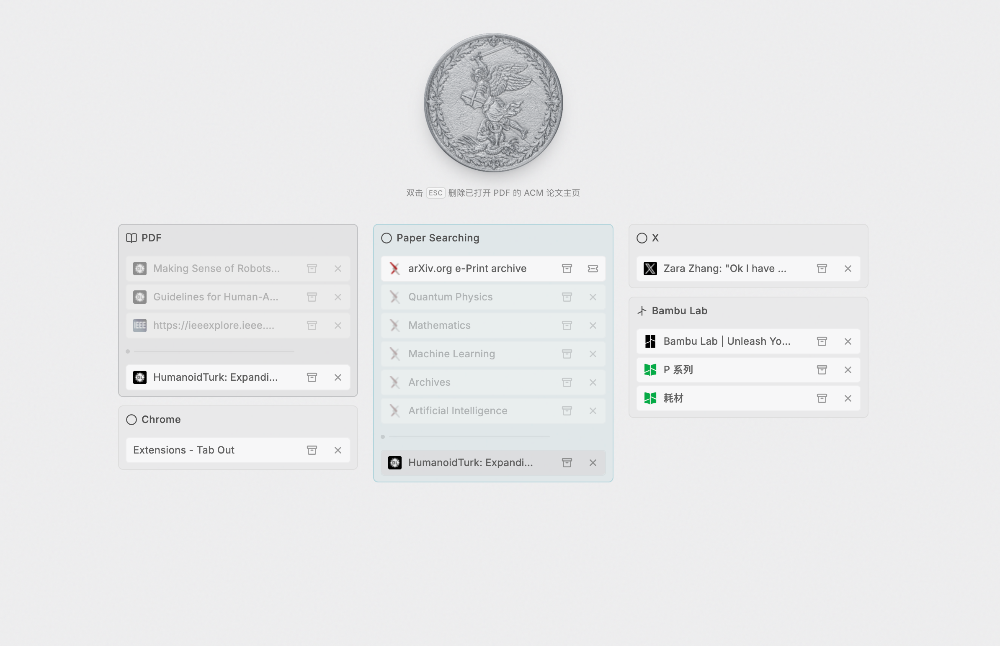

# Tab Out

Tab Out is a Chrome Manifest V3 extension that replaces the new-tab page with a Arc/Zen-ish dashboard of open tabs. 



Optimized for academic paper searching and reading.


I made this for personal everyday use and for my friend's use. So the default language, config, and the preset captain group profile are all adapted to her need for the convenience :). You may need to open the extension's **Options** page to configure your version. You may also be able to find some secrete hidden features that I won't disclose here. Enjoy.


## Install

1. Clone this repository.
2. Open `chrome://extensions` in Chrome.
3. Enable **Developer mode**.
4. Select **Load unpacked** and choose the repository's `extension/` directory.
5. Open a new tab.

In Options, each Task Group accepts `PDF`, domains such as `wikipedia.org`, and exact page URLs such as `https://github.com/ziru-wei/tab-out` in the same matching-rules field. The **PDF Only** profile fills in `PDF`; newly added groups start as **Custom**.


## Storage and network behavior

Tab-management state stays in Chrome's `storage.local` and `storage.session`; no Tab Out account or application backend is used. Explicitly renamed page labels are saved by URL in `storage.local` and reappear if the page is closed and opened again; clearing the label removes the saved name. The dashboard can contact Google Fonts and Google's favicon service for presentation assets. For recognized papers, the service worker can request titles from Crossref or arXiv. Error detection inspects top-level page titles/headings locally and does not upload page text.

## Development

Edit files under `extension/`, then reload Tab Out from `chrome://extensions`. Lightweight static validation can be run with:

```sh
find extension -name '*.js' -print0 | xargs -0 -n1 node --check
node -e "JSON.parse(require('fs').readFileSync('extension/manifest.json', 'utf8'))"
```

## License

MIT
